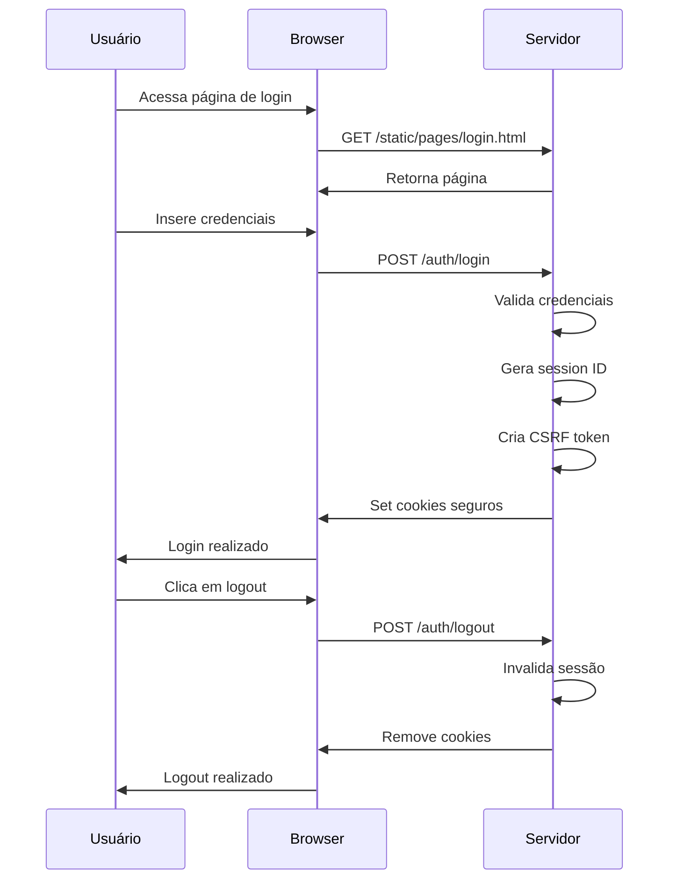

# 🔐 Autenticação com Cookies de Sessão

Esta branch demonstra a implementação de um sistema de autenticação seguro baseado em cookies de sessão, seguindo as melhores práticas de segurança apresentadas no livro **"API Security in Action"** - Capítulo 4.

## 📋 Visão Geral

O sistema implementa um fluxo completo de autenticação que utiliza cookies seguros para gerenciar sessões de usuário, incorporando múltiplas camadas de proteção contra ataques comuns de segurança web.

## ✨ Funcionalidades

### 🔑 **Sistema de Autenticação**
- **Login seguro** com validação de credenciais
- **Logout** com limpeza adequada de sessão
- **Geração automática** de cookies de sessão

### 🛡️ **Medidas de Segurança**
- **Proteção contra Session Fixation**: Regeneração de session ID após login
- **Proteção CSRF**: Implementação do padrão Double Submit Cookie
- **Cookies seguros**: Configurações HttpOnly e Secure. É possível, também, a utilização de SameSite
- **Injeção de dependência**: Arquitetura desacoplada para evitar dependências circulares

### 🏗️ **Arquitetura**
- Classes especializadas para gerenciamento de cookies
- Interfaces para extensibilidade
- Endpoints RESTful dedicados
- Separação clara de responsabilidades

## 🚀 Como Utilizar

### 1. **Iniciar a Aplicação**
```bash
npm run start:dev
```

### 2. **Acessar a Interface de Login**
Navegue até: [https://localhost:3000/static/pages/login.html](https://localhost:3000/static/pages/login.html)

### 3. **Realizar Login**
Utilize as credenciais padrão:
- **Usuário**: `admin`
- **Senha**: `admin@123`

### 4. **Verificar os Cookies**
Após o login bem-sucedido:
1. Abra o **DevTools** do navegador (`F12`)
2. Navegue até a aba **Application** (Chrome) ou **Storage** (Firefox)
3. Na seção **Cookies**, observe os cookies gerados:
   - Cookie de sessão principal
   - Token CSRF para proteção

### 5. **Realizar Logout**
Clique no botão de logout para:
- Invalidar a sessão atual
- Remover o cookie `csrfToken`
- Limpar dados de autenticação

## 🔍 Fluxo de Autenticação



## 🛡️ Medidas de Segurança Implementadas

### **Session Fixation Protection**
- Nova sessão criada a cada login
- Session ID anterior invalidado
- Prevenção de sequestro de sessão

### **CSRF Protection - Double Submit Cookie**
- Token CSRF associado criptograficamente a sessão do usuário

### **Cookie Security**
- `HttpOnly`: Previne acesso via JavaScript
- `Secure`: Transmissão apenas via HTTPS
- `SameSite`: Proteção contra ataques cross-site

## 📚 Referências

Este projeto segue as diretrizes de segurança do livro:
**"API Security in Action"** - Capítulo 4: Session-based Authentication

---

> **Nota**: Este é um projeto educacional focado no aprendizado de práticas de segurança em APIs. Para uso em produção, considere implementações adicionais de segurança conforme sua necessidade específica.